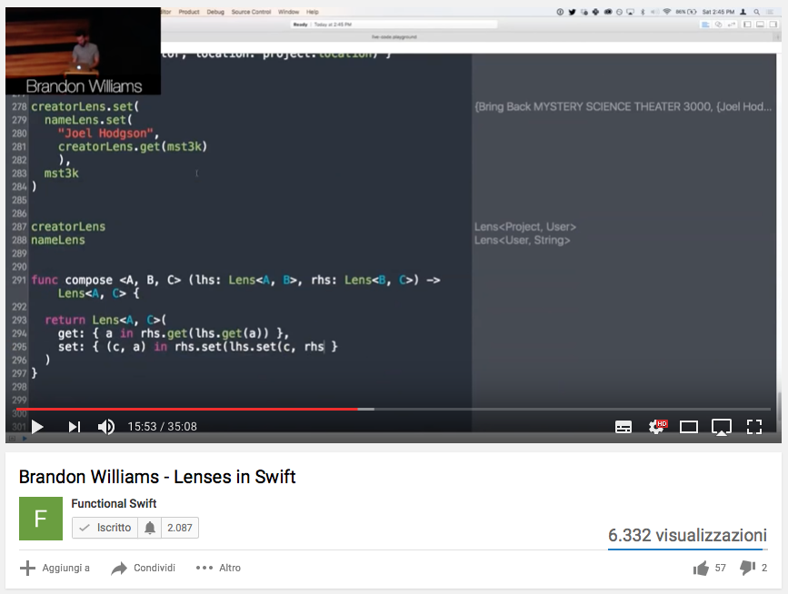
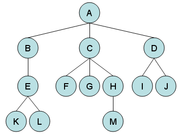

theme: Fira, 1
build-lists: true

# [fit] Lenses and Prisms in Swift

^
Thanks for having me here
These concepts have been around
More pragmatic perspective

---



^ 
A little background
Encapsulate the access to data
A lens allows to "focus"

---

# [fit] Functional getters and setters

^
Functional: immutable
Not a useful definition
Swift value types are immutable

---

```swift
let repo = PersonRepository.init() // class

var p = Person.init(firstName: "Jane", lastName: "Doe") // struct

repo.add(p)

p.firstName = "John"

repo.add(p)
```

---

# Lenses and Prisms

- **encapsulate** data references and relations
- **simple** to define
- **composition** tools
- build powerful **abstractions**

^
I like practical examples
But the definition is so simple

---

```swift
struct Lens<Whole,Part> {
    let get: (Whole) -> Part
    let set: (Part) -> (Whole) -> Whole
}

struct Prism<Whole,Part> {
    let tryGet: (Whole) -> Part?
    let inject: (Part) -> Whole
}
```

^
Many ways to define

---

```swift, [.highlight: 1,4]
struct Lens<Whole,Part> {
    let get: (Whole) -> Part
    let set: (Part) -> (Whole) -> Whole
}

struct Prism<Whole,Part> {
    let tryGet: (Whole) -> Part?
    let inject: (Part) -> Whole
}
```

^
struct generic in 2 parameters

---

```swift, [.highlight: 2,3]
struct Lens<Whole,Part> {
    let get: (Whole) -> Part
    let set: (Part) -> (Whole) -> Whole
}

struct Prism<Whole,Part> {
    let tryGet: (Whole) -> Part?
    let inject: (Part) -> Whole
}
```

^
first-class functions
set doesn't care about same whole instance or different

---

```swift, [.highlight: 6,9]
struct Lens<Whole,Part> {
    let get: (Whole) -> Part
    let set: (Part) -> (Whole) -> Whole
}

struct Prism<Whole,Part> {
    let tryGet: (Whole) -> Part?
    let inject: (Part) -> Whole
}
```

^
prism is for enums

---

```swift
enum ViewState<T> {
    case empty
    case processing(String)
    case failed(Error)
    case completed(T)
}
```

^
whole is ViewState<T>
part depends on the case

---

```swift, [.highlight: 1,3,6]
enum ViewState<T> {
    case empty
    case processing(String)
    case failed(Error)
    case completed(T)
}
```

---

```swift, [.highlight: 7]
struct Lens<Whole,Part> {
    let get: (Whole) -> Part
    let set: (Part) -> (Whole) -> Whole
}

struct Prism<Whole,Part> {
    let tryGet: (Whole) -> Part?
    let inject: (Part) -> Whole
}
```

^
the case could be not the one the prism focuses on

---

```swift, [.highlight: 8]
struct Lens<Whole,Part> {
    let get: (Whole) -> Part
    let set: (Part) -> (Whole) -> Whole
}

struct Prism<Whole,Part> {
    let tryGet: (Whole) -> Part?
    let inject: (Part) -> Whole
}
```

^
inject discards the previous value

---

```swift
struct Lens<Whole,Part> {
    let get: (Whole) -> Part
    let set: (Part) -> (Whole) -> Whole
}

struct Prism<Whole,Part> {
    let tryGet: (Whole) -> Part?
    let inject: (Part) -> Whole
}
```

^
done with the basic definition
let's use them

---



^
tree-like structure
parent-child relation

---

# View

^
view model is preferable

---

# ViewModel

^
not the interpretation as class with logic
my models only represent data
they're acted upon with functions

---

# Functional ViewModel

^
just data
lenses and prism simply contain pure functions
manipulate data from the outside

---

```swift
struct LoginPage {
    var title: String
    var credendials: CredentialBox
    var buttonState: ViewState<Button>
}

struct CredentialBox {
    var usernameField: TextField
    var passwordField: TextField
}

struct TextField {
    var text: String
    var placeholder: String?
    var secureText: Bool
}

struct Button {
    var title: String
    var enabled: Bool
}
```

^
everything is var (value types)

---

```swift, [.highlight: 4,18-21]
struct LoginPage {
    var title: String
    var credendials: CredentialBox
    var buttonState: ViewState<Button>
}

struct CredentialBox {
    var usernameField: TextField
    var passwordField: TextField
}

struct TextField {
    var text: String
    var placeholder: String?
    var secureText: Bool
}

struct Button {
    var title: String
    var enabled: Bool
}
```

^
async validation with ViewState enum

---

```swift
extension CredentialBox {
	enum lens {
		static let usernameField = Lens<CredentialBox,TextField>.init(
			get: { $0.usernameField },
			set: { part in
				{ whole in
					var m = whole
					m.usernameField = part
					return m
				}
		})
	}
}
```

^
static stored property
only one "sane" way to write this

---

```swift
extension ViewState {
	enum prism {
		static var processing: Prism<ViewState,String> {
			return .init(
				tryGet: {
					guard case .processing(let message) = $0 else {
						return nil
					}
					return message
				},
				inject: { .processing($0) })
		}
	}
}
```

^
cannot store static properties in generic types

---

# Manipulate the model

- a previous model exists
- set a greeting title
- set a stored username
- button initially not enabled

^
with immutable data it would be unreadable
value types allow safe "mutation" (not really mutation)

---

```swift
let initialState = (
	title: "Welcome back!",
	username: savedUsername,
	buttonState: ViewState<Button>.completed(Button.init(
		title: "Login",
		enabled: false)))

var m_newModel = oldModel
m_newModel.title = initialState.title
m_newModel.credendials.usernameField.text = initialState.username
m_newModel.buttonState = initialState.buttonState
```

^
rough edges

---

```swift, [.highlight: 10]
let initialState = (
	title: "Welcome back!",
	username: savedUsername,
	buttonState: ViewState<Button>.completed(Button.init(
		title: "Login",
		enabled: false)))

var m_newModel = oldModel
m_newModel.title = initialState.title
m_newModel.credendials.usernameField.text = initialState.username
m_newModel.buttonState = initialState.buttonState
```

^
a pain to change

---

### `Lens<A,B> + Lens<B,C> = Lens<A,C>`

^ 
we can always define something like this
no prior knowledge of the data structure

---

```swift
extension Lens {	
	func compose<Subpart>(_ other: Lens<Part,Subpart>) -> Lens<Whole,Subpart> {
		/// some code
	}
}

extension Prism {	
	func compose<Subpart>(_ other: Prism<Part,Subpart>) -> Prism<Whole,Subpart> {
		/// some code
	}
}
```

^
codes almost writes itself, thanks to the types

---

```swift
let titleLens = LoginPage.lens.title

let usernameTextLens = LoginPage.lens.credentials
    .compose(CredentialBox.lens.usernameField)
    .compose(TextField.lens.text)
    
let buttonStateLens = LoginPage.lens.buttonState
```

^
let's grab some lenses

---

```swift
let newModel = titleLens.set(initialState.title)
    (usernameTextLens.set(initialState.username)
    (buttonStateLens.set(initialState.buttonState)
    (oldModel)))
```

^
setting again and again on old model
we want to combine lenses horizontally

---

### `Lens<A,B1> + Lens<A,B2> = Lens<A,(B1,B2)>`

---

```swift
extension Lens {
	static func zip<Part1,Part2>(
		_ a: Lens<Whole,Part1>,
		_ b: Lens<Whole,Part2>)
		-> Lens<Whole,(Part1,Part2)>
		where Part == (Part1,Part2)
	{
		/// some code
	}
}
```

^
we can define it for any number of lenses

---

```swift
let initialStateLens = Lens.zip(
	titleLens,
	usernameTextLens,
	buttonStateLens)
	
let newModel = initialStateLens
	.set(initialState)(oldModel)
```

^
extremely encapsulated
built from basic pieces and combinators

---

# What about prisms?

^
the button is in processing
we want change the message as time passes

---

```swift
func advanceProcessingMessage(_ previous: String) -> String {
	switch previous {
	case "Please wait":
		return "Almost there"
	case "Almost there":
		return "ALMOST THERE"
	default:
		return previous + "!"
	}
}
```

^ 
clean, isolated pure function
a small piece of business logic
not a pure set
we need a over function

---

```swift
extension Lens {
	func over(_ transform: (Part) -> Part) -> (Whole) -> Whole {
		/// some code
	}
}

extension Prism {
	func tryOver(_ transform: (Part) -> Part) -> (Whole) -> Whole {
		/// some code
	}
}
```

^ 
tryOver "tries"
the starting `Whole` must be the correct case, otherwise it returns it unmodified

---

### `Lens<LoginPage,ViewState<Button>>` 
### `+`
### `Prism<ViewState<Button>,String>`
### `=`
### ?

^
no good way to do this

---

## What if lenses and prisms don't compose well?

---

## Who cares? Under the hood it's just functions.

^
functions compose if the types match

---

### `(A -> B) + (B -> C) = (A -> C)`

^
can always be done

---

```swift
infix operator •

func • <A,B,C> (
	_ left: @escaping (B) -> C,
	_ right: @escaping (A) -> B)
	-> (A) -> C
{
	return { left(right($0)) }
}
```

^
let's combine lens over with prism tryOver

---

```swift, [.highlight: 1]
let processingPrism = ViewState<Button>.prism.processing

let onProcessing = buttonStateLens.over • processingPrism.tryOver

let newModel = onProcessing(advanceProcessingMessage)(oldModel)
```

---

```swift, [.highlight: 1-3]
let processingPrism = ViewState<Button>.prism.processing

let onProcessing = buttonStateLens.over • processingPrism.tryOver

let newModel = onProcessing(advanceProcessingMessage)(oldModel)
```

---

```swift
let processingPrism = ViewState<Button>.prism.processing

let onProcessing = buttonStateLens.over • processingPrism.tryOver

let newModel = onProcessing(advanceProcessingMessage)(oldModel)
```

^
easy?
it looks like magic

---

```swift, [.highlight: 3]
let processingPrism = ViewState<Button>.prism.processing

let onProcessing = buttonStateLens.over • processingPrism.tryOver

let newModel = onProcessing(advanceProcessingMessage)(oldModel)
```

^
let's unpack

---

### `(B -> B) -> (A -> A)` 
### `•`
### `(C -> C) -> (B -> B)`
### `=`
### `(C -> C) -> (A -> A)`

^
let's use the real types

---

#### `(ViewState<Button> -> ViewState<Button>) -> (LoginPage -> LoginPage)` 
#### `•`
#### `(String -> String) -> (ViewState<Button> -> ViewState<Button>)`
#### `=`
#### `(String -> String) -> (LoginPage -> LoginPage)`

---

```swift, [.highlight: 5]
let processingPrism = ViewState<Button>.prism.processing

let onProcessing = buttonStateLens.over • processingPrism.tryOver

let newModel = onProcessing(advanceProcessingMessage)(oldModel)
```

---
[.autoscale: true]
# Let's recap

- **separated** logic for accessing and mutating data;
- defined **simple**, composable atomic objects;
- built more complex objects just by **combination**;
- transformed data with multiple, **independent** pieces;
- types are the only **interface**;
- nothing will break if types don't change;
- **are we sure?**

---

# Buggy lenses?

^
types are the only interface
if I give you a lens...

---

# [fit]AXIOMS

^
or laws

---

# Axioms

- required when building large systems from **small pieces**
- we need to **trust** the pieces
- they are **implicit** in tests
- let's define them **explicitly** for Lenses and Prisms

---

# Laws: Lens

- **getSet**: the whole is the same 
- **setGet**: the part is the same
- **setSet**: idempotence

---

# Laws: Prisms

- **tryGetInject**
- **injectTryGet**

^
the whole instance is completely defined by its parts

---

```swift
struct LensLaw {
	static func setGet<Whole, Part>(
		lens: Lens<Whole,Part>,
		whole: Whole,
		part: Part)
		-> Bool where Part: Equatable
	{
		return lens.get(lens.set(part)(whole)) == part
	}
}
```

^ 
example
generate the data
we always see this with tests
property-based testing libraries: I'm not getting into it

---

# Do we need to test ALL lenses and prisms?

- **trivial** lenses have always the same structure;
- if written **by hand**, tests can be useful;
- lots of **boilerplate**;
- a perfect fit for **code generation**.

---

# Non-trivial lenses and prisms

- outputs of combinators;
- particular data structures.

---

```swift
extension Dictionary {
	static func lens(at key: Key) -> Lens<Dictionary,Value?> {
		return Lens<Dictionary,Value?>(
			get: { $0[key] },
			set: { part in
				{ whole in
					var m_dict = whole
					m_dict[key] = part
					return m_dict
				}
		})
	}
}
```

^
I want to able to test this
lens laws are the answer

---

```swift, [.highlight: 2]
extension Dictionary {
	static func lens(at key: Key) -> Lens<Dictionary,Value?> {
		return Lens<Dictionary,Value?>(
			get: { $0[key] },
			set: { part in
				{ whole in
					var m_dict = whole
					m_dict[key] = part
					return m_dict
				}
		})
	}
}
```

^
part is optional
this is not composable anymore

---

### `Lens<A,B?> + Lens<B,C> = ?`

---

### `Lens<A,B?> + Lens<B,C> = Lens<A,C?>`

---

```swift
func compose<A,B,C>(
	_ first: Lens<A,B?>,
	_ second: Lens<B,C>)
	-> Lens<A,C?> {
	/// some code	
}
```

^
this is wrong just by the signature
setGet will fail

---

```swift, [.highlight: 4]
func compose<A,B,C>(
	_ first: Lens<A,B?>,
	_ second: Lens<B,C>,
	injecting: B)
	-> Lens<A,C?> {
	/// some code	
}
```

^ 
I need to produce B
in testing it, I need to produce random Bs to inject to prove that it works

---

# **Optics** library

https://github.com/facile-it/Optics

- Lens and Prism **definitions**
- some **combinators**
- **Law** functions

^
definitions for laws for testing one's own lenses and prisms

---

# Thanks

---
[.build-lists: false]
# Links and Contacts

- @_logicist
- https://github.com/broomburgo/Lenses-and-Prisms-in-Swift
- https://github.com/facile-it/Optics
- B.W.'s talk: https://youtu.be/ofjehH9f-CU