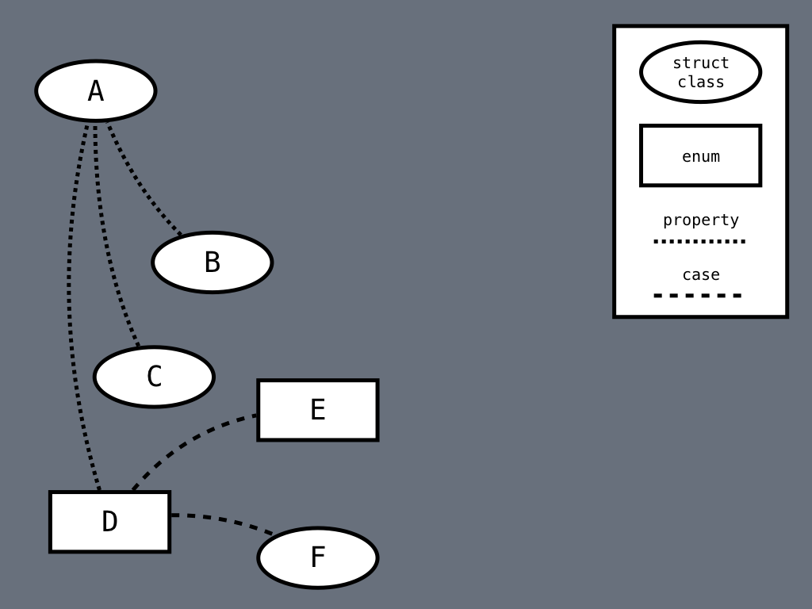
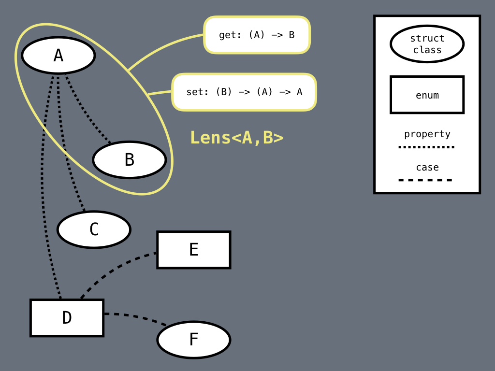
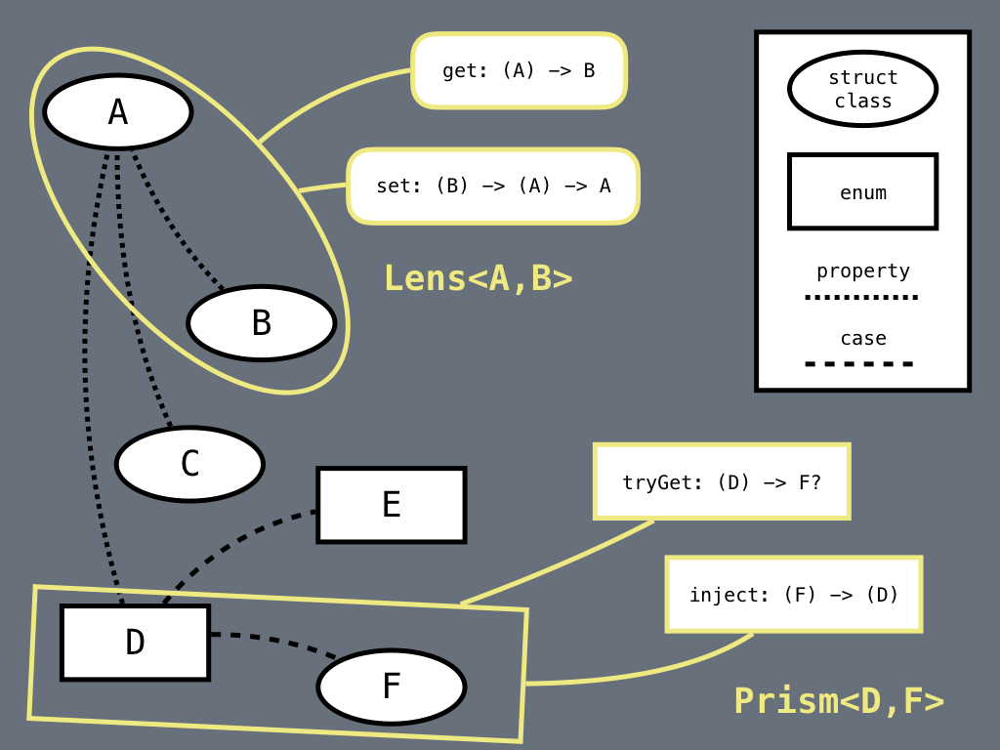
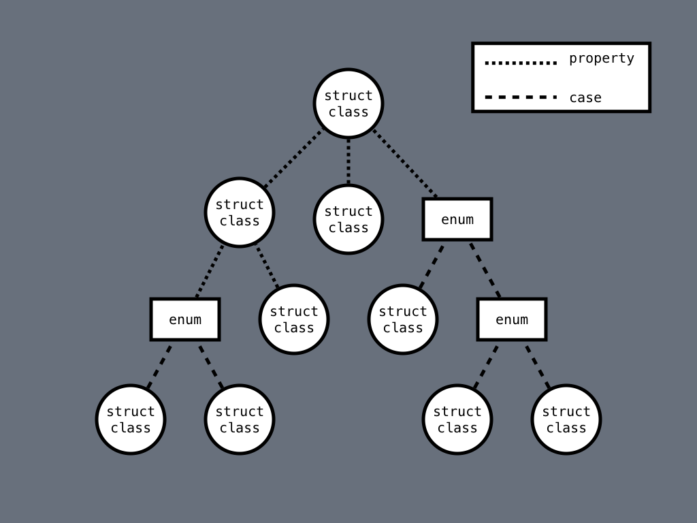

theme: Fira, 1
build-lists: true

[.footer: This work is licensed under the Creative Commons Attribution-NonCommercial-ShareAlike 3.0 Unported License. To view a copy of this license, visit http://creativecommons.org/licenses/by-nc-sa/3.0/ or send a letter to Creative Commons, PO Box 1866, Mountain View, CA 94042, USA.]

# [fit] Lenses and Prisms in Swift

^
Thanks for having me here
These concepts have been around

---

# [fit] Functional getters and setters

^
Functional: immutable
Not a useful definition
Swift value types are immutable (as we will see)

---

# Lenses and Prisms

- **encapsulate** a relationship between a data structure and its parts
- **simple** to define
- **composition** tools
- build powerful **abstractions**

^
Optics allows to "focus"
Let's see it graphically

---



^
a data structure
structs and classes with properties
enums with cases

---



^
a lens is for properties
defines two functions

---



^
a prism is for cases
defines two functions
the definition in code is still pretty simple

---

```swift
struct Lens<Whole,Part> {
  let get: (Whole) -> Part
  let set: (Part) -> (Whole) -> Whole
}

struct Prism<Whole,Part> {
  let tryGet: (Whole) -> Part?
  let inject: (Part) -> Whole
}
```

^
Many ways to define

---

```swift, [.highlight: 1,4]
struct Lens<Whole,Part> {
  let get: (Whole) -> Part
  let set: (Part) -> (Whole) -> Whole
}

struct Prism<Whole,Part> {
  let tryGet: (Whole) -> Part?
  let inject: (Part) -> Whole
}
```

^
struct generic in 2 parameters

---

```swift, [.highlight: 2,3]
struct Lens<Whole,Part> {
  let get: (Whole) -> Part
  let set: (Part) -> (Whole) -> Whole
}

struct Prism<Whole,Part> {
  let tryGet: (Whole) -> Part?
  let inject: (Part) -> Whole
}
```

^
first-class functions

---

```swift, [.highlight: 6,9]
struct Lens<Whole,Part> {
  let get: (Whole) -> Part
  let set: (Part) -> (Whole) -> Whole
}

struct Prism<Whole,Part> {
  let tryGet: (Whole) -> Part?
  let inject: (Part) -> Whole
}
```

^
prism is for enums

---

```swift
enum ViewState<T> {
  case empty
  case processing(String)
  case failed(Error)
  case completed(T)
}
```

^
whole is ViewState<T>
part depends on the case

---

```swift, [.highlight: 1,3,6]
enum ViewState<T> {
  case empty
  case processing(String)
  case failed(Error)
  case completed(T)
}
```

---

```swift, [.highlight: 7]
struct Lens<Whole,Part> {
  let get: (Whole) -> Part
  let set: (Part) -> (Whole) -> Whole
}

struct Prism<Whole,Part> {
  let tryGet: (Whole) -> Part?
  let inject: (Part) -> Whole
}
```

^
the case could be not the one the prism focuses on

---

```swift, [.highlight: 8]
struct Lens<Whole,Part> {
  let get: (Whole) -> Part
  let set: (Part) -> (Whole) -> Whole
}

struct Prism<Whole,Part> {
  let tryGet: (Whole) -> Part?
  let inject: (Part) -> Whole
}
```

^
inject discards the previous value

---

```swift
struct Lens<Whole,Part> {
  let get: (Whole) -> Part
  let set: (Part) -> (Whole) -> Whole
}

struct Prism<Whole,Part> {
  let tryGet: (Whole) -> Part?
  let inject: (Part) -> Whole
}
```

^
done with the basic definition
let's use them

---



^
tree-like structure
parent-child relationship

---

# View

^
view model is preferable

---

# ViewModel

^
not the interpretation as class with logic
my models only represent data
they're acted upon with functions

---

# Functional ViewModel

^
just data
lenses and prism simply contain pure functions
manipulate data from the outside

---

```swift
struct LoginPage {
  var title: String
  var credendials: CredentialBox
  var buttonState: ViewState<Button>
}

struct CredentialBox {
  var usernameField: TextField
  var passwordField: TextField
}

struct TextField {
  var text: String
  var placeholder: String?
  var secureText: Bool
}

struct Button {
  var title: String
  var enabled: Bool
}
```

^
everything is var (value types)

---

```swift, [.highlight: 4,18-21]
struct LoginPage {
  var title: String
  var credendials: CredentialBox
  var buttonState: ViewState<Button>
}

struct CredentialBox {
  var usernameField: TextField
  var passwordField: TextField
}

struct TextField {
  var text: String
  var placeholder: String?
  var secureText: Bool
}

struct Button {
  var title: String
  var enabled: Bool
}
```

^
async validation with ViewState enum

---

```swift
extension CredentialBox {
  enum lens {
    static var usernameField: Lens<CredentialBox,TextField> {
      return Lens<CredentialBox,TextField>.init(
        get: { whole in
          whole.usernameField
        },
        set: { part in
          { whole in
            var mutableWhole = whole
            mutableWhole.usernameField = part
            return mutableWhole
          }
        }
      )
    }
  }
}
```

^
static stored property
only one "sane" way to write this

---

```swift
extension ViewState {
  enum prism {
    static var processing: Prism<ViewState,String> {
      return .init(
        tryGet: { whole in
          guard case .processing(let message) = whole else {
            return nil
          }
          return message
        },
        inject: { part in
          .processing(part)
        }
      )
    }
  }
}
```

^
cannot store static properties in generic types

---

# Manipulate the model

- a previous model exists
- set a greeting title
- set a stored username
- button initially not enabled

^
with immutable data it would be unreadable
value types allow safe "mutation" (not really mutation)

---

```swift
let initialState = (
  title: "Welcome back!",
  username: savedUsername,
  buttonState: ViewState<Button>.completed(Button.init(
    title: "Login",
    enabled: false)))

var mutableNewModel = oldModel
mutableNewModel.title = initialState.title
mutableNewModel.credendials.usernameField.text = initialState.username
mutableNewModel.buttonState = initialState.buttonState
```

^
rough edges

---

```swift, [.highlight: 10]
let initialState = (
  title: "Welcome back!",
  username: savedUsername,
  buttonState: ViewState<Button>.completed(Button.init(
    title: "Login",
    enabled: false)))

var mutableNewModel = oldModel
mutableNewModel.title = initialState.title
mutableNewModel.credendials.usernameField.text = initialState.username
mutableNewModel.buttonState = initialState.buttonState
```

^
a pain to change

---

### [fit] `Lens<A,B> + Lens<B,C> = Lens<A,C>`

^ 
we can always define something like this
no prior knowledge of the data structure

---

```swift
extension Lens {  
  func compose<Subpart>(_ other: Lens<Part,Subpart>) -> Lens<Whole,Subpart> {
    /// some code
  }
}

extension Prism {  
  func compose<Subpart>(_ other: Prism<Part,Subpart>) -> Prism<Whole,Subpart> {
    /// some code
  }
}
```

^
codes almost writes itself, thanks to the types

---

```swift
let titleLens = LoginPage.lens.title

let usernameTextLens = LoginPage.lens.credentials
    .compose(CredentialBox.lens.usernameField)
    .compose(TextField.lens.text)
    
let buttonStateLens = LoginPage.lens.buttonState
```

^
let's grab some lenses

---

```swift
let newModel = titleLens.set(initialState.title)
    (usernameTextLens.set(initialState.username)
    (buttonStateLens.set(initialState.buttonState)
    (oldModel)))
```

^
setting again and again on old model
we want to combine lenses horizontally

---

### [fit] `Lens<A,B1> + Lens<A,B2> = Lens<A,(B1,B2)>`

---

```swift
extension Lens {
  static func zip<Part1,Part2>(
    _ a: Lens<Whole,Part1>,
    _ b: Lens<Whole,Part2>)
    -> Lens<Whole,(Part1,Part2)>
    where Part == (Part1,Part2)
  {
    /// some code
  }
}

extension Prism {
  static func zip<Part1,Part2>(
    _ a: Prism<Whole,Part1>,
    _ b: Prism<Whole,Part2>)
    -> Prism<Whole,Either<Part1,Part2>>
    where Part == Either<Part1,Part2>
  {
    /// some code
  }
}
```

^
we can define it for any number of lenses
prisms zip returns either

---

```swift
let initialStateLens = Lens.zip(
  titleLens,
  usernameTextLens,
  buttonStateLens)
  
let newModel = initialStateLens.set(initialState)(oldModel)
```

^
extremely encapsulated
built from basic pieces and combinators

---

# What about prisms?

^
the button is in processing
we want change the message as time passes

---

```swift
func advanceProcessingMessage(_ previous: String) -> String {
  switch previous {
  case "Please wait":
    return "Almost there"
  case "Almost there":
    return "ALMOST THERE"
  default:
    return previous + "!"
  }
}
```

^ 
clean, isolated pure function
a small piece of business logic
not a pure set
we need a modify function

---

```swift
extension Lens {
  func modify(_ transform: (Part) -> Part) -> (Whole) -> Whole {
    /// some code
  }
}

extension Prism {
  func tryModify(_ transform: (Part) -> Part) -> (Whole) -> Whole {
    /// some code
  }
}
```

^ 
tryModify "tries"
the starting `Whole` must be the correct case, otherwise it returns it unmodified

---

```swift
/// Prism<ViewState<Button>,String>
let processingPrism = ViewState<Button>.prism.processing

let modifyLoginPage: ((ViewState<Button>) -> ViewState<Button>)
  -> (LoginPage) -> LoginPage
  
modifyLoginPage = buttonStateLens.modify

let modifyProcessingMessage: ((String) -> String)
  -> (ViewState<Button>) -> ViewState<Button>
  
modifyProcessingMessage = processingPrism.tryModify
```

---

```swift, [.highlight: 4,5,9,10]
/// Prism<ViewState<Button>,String>
let processingPrism = ViewState<Button>.prism.processing

let modifyLoginPage: ((ViewState<Button>) -> ViewState<Button>)
  -> (LoginPage) -> LoginPage
  
modifyLoginPage = buttonStateLens.modify

let modifyProcessingMessage: ((String) -> String)
  -> (ViewState<Button>) -> ViewState<Button>
  
modifyProcessingMessage = processingPrism.tryModify
```

---

### `(A -> B) + (B -> C) = (A -> C)`

^
can always be done

---

```swift
infix operator >>>

func >>> <A,B,C> (
	_ left: @escaping (A) -> B,
	_ right: @escaping (B) -> C)
	-> (A) -> C
{
	return { right(left($0)) }
}
```

^
let's combine lens modify with prism tryModify

---

```swift
let onProcessing: ((String) -> String) -> (LoginPage) -> LoginPage

onProcessing = modifyProcessingMessage >>> modifyLoginPage

let newModel = onProcessing(advanceProcessingMessage)(oldModel)
```

^
easy?
it looks like magic

---

[.autoscale: true]
# Let's recap

- **separated** logic for accessing and mutating data;
- defined **simple**, composable atomic objects;
- built more complex objects just by **combination**;
- transformed data with multiple, **independent** pieces;
- types are the only **interface**;
- nothing will break if types don't change;
- **are we sure?**

---

# Buggy lenses?

^
types are the only interface
if I give you a lens...

---

# [fit]LAWS

^
or axioms

---

# Laws

- required when building large systems from **small pieces**
- we need to **trust** the pieces
- they are **implicit** in tests
- let's define them **explicitly** for Lenses and Prisms

---

# Laws: Lens

- **getSet**: the whole stays the same 
- **setGet**: the part stays the same
- **setSet**: set is idempotent

---

# Laws: Prisms

- **tryGetInject**
- **injectTryGet**

^
the whole instance is completely defined by its parts

---

```swift
struct LensLaw {
  static func setGet<Whole, Part>(
    lens: Lens<Whole,Part>,
    whole: Whole,
    part: Part)
    -> Bool where Part: Equatable
  {
    return lens.get(lens.set(part)(whole)) == part
  }
}
```

^ 
example
generate the data
we always see this with tests
property-based testing libraries: I'm not getting into it

---

# Do we need to test ALL lenses and prisms?

- **trivial** lenses have always the same structure;
- if written **by hand**, tests can be useful;
- lots of **boilerplate**;
- a perfect fit for **code generation**;
- **Sourcery**

---

# Deriving `Lens` from `KeyPath`

---

```swift
extension WritableKeyPath {
  var lens: Lens<Root,Value> {
    return Lens<Root,Value>.init(
      get: { root in 
        root[keyPath: self] 
      },
      set: { value in
        { root in
          var mutableRoot = root
          mutableRoot[keyPath: self] = value
          return mutableRoot
        }
      }
    )
  }
}

let passwordLens = (\LoginPage.credentials.passwordField.text).lens
```

---

# Non-trivial lenses and prisms

- outputs of combinators;
- particular data structures.

---

```swift
extension Dictionary {
  static func lens(at key: Key) -> Lens<Dictionary,Value?> {
    return Lens<Dictionary,Value?>(
      get: { dict in
        dict[key]
      },
      set: { value in
        { dict in
          var mutableDict = dict
          mutableDict[key] = value
          return mutableDict
        }
      }
    )
  }
}
```

^
I want to able to test this
lens laws are the answer

---

```swift, [.highlight: 2]
extension Dictionary {
  static func lens(at key: Key) -> Lens<Dictionary,Value?> {
    return Lens<Dictionary,Value?>(
      get: { dict in
        dict[key]
      },
      set: { value in
        { dict in
          var mutableDict = dict
          mutableDict[key] = value
          return mutableDict
        }
      }
    )
  }
}
```

^
part is optional
this is not composable anymore

---

### `Lens<A,B?> + Lens<B,C> = ?`

---

```swift
extension Optional {
  static var prism: Prism<Optional,Wrapped> {
    return Prism<Optional,Wrapped>.init(
      tryGet: { $0 },
      inject: Optional.some
    )
  }
}
```

---

### [fit] `Lens<A,B?> + Prism<B?,B> + Lens<B,C> = ?`

---

```swift
struct Affine<Whole,Part> {
  let tryGet: (Whole) -> Part?
  let trySet: (Part) -> (Whole) -> Whole?
}

/// laws are similar to lens'

/// es. Affine to an index of an Array
```

---

### [fit] `Lens<A,B> + Prism<B,C> = Affine<A,C>`

---

### `Lens<A,B> -> Affine<A,B>`
### `Prism<A,B> -> Affine<A,B>`

---

### `Lens<A,B?> + Prism<B?,B> + Lens<B,C> =`
### `Affine<A,B> + Lens<B,C> =`
### `Affine<A,B> + Affine<B,C> =`
### `Affine<A,C>`

---

# **FunctionalKit** library

https://github.com/facile-it/FunctionalKit

- Lens, Prism, Affine **definitions**
- some **combinators**
- **Law** functions

^
definitions for laws for testing one's own lenses and prisms

---

# Thanks

---
[.build-lists: false]
# Links and Contacts

- @_logicist
- https://github.com/broomburgo/Lenses-and-Prisms-in-Swift
- https://github.com/facile-it/FunctionalKit
- Brandon Williams's original talk on lenses: https://youtu.be/ofjehH9f-CU